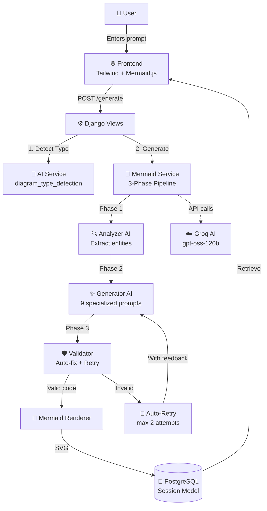

# 🚀 VisualFlow - AI-Powered Diagram Generator

[](https://www.djangoproject.com/)
[](https://www.python.org/)
[](https://www.postgresql.org/)
[](https://mermaid.js.org/)
[](LICENSE)

**VisualFlow** is a production-ready fullstack Django web application that transforms natural language descriptions into professional, emoji-enhanced diagrams using advanced AI. Built with **Django 5.2.7**, **PostgreSQL**, **Mermaid.js v10.9.1**, and powered by **Groq AI** (`openai/gpt-oss-120b` model) with intelligent **three-phase diagram generation**: Analyze → Generate → Validate with auto-retry and loop protection.


---


### 📊 **Supported Diagram Types (9 Specialized Prompts)**

| Diagram Type | Use Case | AI Prompt File | Status |
|-------------|----------|----------------|--------|
| **Flowchart** 📈 | Process flows, workflows, decision trees | `flowchart_prompt.py` | ✅ Production |
| **UML Class** 🏗️ | OOP designs, inheritance, relationships | `class_diagram_prompt.py` | ✅ Production |
| **ER Diagram** 🗃️ | Database schemas, entity relationships | `er_diagram_prompt.py` | ✅ Production |
| **Sequence** 📡 | API interactions, message flows | `sequence_diagram_prompt.py` | ✅ Production |
| **State** 🔀 | Finite state machines, transitions | `state_diagram_prompt.py` | ✅ Production |
| **DFD** 🔄 | Data flow (Level 0/1/2+), processes | `dfd_prompt.py` | ✅ Production |
| **System Design** 🏭 | Architecture, microservices, infra | `system_design_prompt.py` | ✅ Production |
| **Custom** 🎨 | AI auto-detects best type | `custom_prompt.py` | ✅ Production |
| **Analyzer** 🔍 | Prompt analysis & enhancement | `analyzer_prompt.py` | ✅ Production |

### 🎨 **Visual Excellence**

- **Emoji-Enhanced Diagrams**: Context-aware emojis in labels (🎯 ⚙️ 💾 ✅ ❌ 🔐 📊)
- **Professional Design**: Clean SVG rendering with proper spacing
- **Mermaid v10.9.1**: Latest stable version with advanced features
- **Responsive**: Works on desktop, tablet, and mobile
- **Dark Mode Ready**: Diagrams adapt to theme

### 🛠️ **Robust Error Handling**

- ✅ **Syntax Validator**: Catches 15+ common Mermaid errors
- ✅ **Auto-Fix Engine**: Fixes bracket mixups, edge syntax, node IDs
- ✅ **Loop Protection**: Detects stuck generation (code unchanged)
- ✅ **Smart Retry**: AI learns from errors (max 2 attempts)
- ✅ **Graceful Fallback**: Always returns valid diagram template
- ✅ **Detailed Logging**: Full trace for debugging

### 💾 **Database & Data Management**

**PostgreSQL Models:**
- **Session**: Stores prompts, generated Mermaid code, SVG, status, timestamps
- **Contact**: Contact form submissions with email notifications
- **AppSettings**: Global config (debug mode toggle for showing code)

**Features:**
- UUID-based session IDs for security
- Full diagram history with search
- Export diagrams (SVG, PNG, PDF)
- Bulk delete operations
- Download original Mermaid code

---

## 📋 Prerequisites

Before installation, ensure you have:

| Requirement | Version | Purpose |
|------------|---------|---------|
| **Python** | 3.10+ | Backend runtime |
| **PostgreSQL** | 12+ | Production database |
| **Node.js** | 16+ | Tailwind CSS compilation |
| **npm** | 8+ | Package manager |
| **Git** | Latest | Version control |
| **Groq API Key** | - | AI generation (free tier available) |

**Operating Systems**: Windows 10/11, macOS 10.15+, Linux (Ubuntu 20.04+)

---

## 🚀 Quick Start Guide

### **Step 1: Clone Repository**

```bash
git clone https://github.com/rishiyaduwanshi/visualflow.git
cd visualflow
cd visualflow  # Navigate to Django project directory
```

### **Step 2: Python Virtual Environment**

**Windows (PowerShell):**
```powershell
python -m venv venv
.\venv\Scripts\Activate.ps1
# If execution policy error: Set-ExecutionPolicy -ExecutionPolicy RemoteSigned -Scope CurrentUser
```

**Linux/macOS:**
```bash
python3 -m venv venv
source venv/bin/activate
```

**Verify activation:** You should see `(venv)` in your terminal prompt.

### **Step 3: Install Python Dependencies**

```bash
pip install --upgrade pip
pip install -r requirements.txt
```

**Key Dependencies Installed:**
- `Django==5.2.7` - Web framework
- `psycopg==3.3.2` - PostgreSQL adapter
- `langchain==0.3.27` - AI framework
- `langchain-groq==0.3.8` - Groq integration
- `groq==0.32.0` - Groq client
- `django-tailwind==4.2.0` - Tailwind CSS integration
- `python-dotenv==1.1.1` - Environment variables
- `gunicorn==25.0.3` - Production server

### **Step 4: PostgreSQL Database Setup**

**Option A: Local PostgreSQL**

```bash
# Install PostgreSQL (if not installed)
# Windows: Download from https://www.postgresql.org/download/windows/
# macOS: brew install postgresql@14
# Ubuntu: sudo apt install postgresql postgresql-contrib

# Create database
psql -U postgres
CREATE DATABASE visualflow_db;
CREATE USER visualflow_user WITH PASSWORD 'your_secure_password';
ALTER ROLE visualflow_user SET client_encoding TO 'utf8';
ALTER ROLE visualflow_user SET default_transaction_isolation TO 'read committed';
ALTER ROLE visualflow_user SET timezone TO 'UTC';
GRANT ALL PRIVILEGES ON DATABASE visualflow_db TO visualflow_user;
\q
```

**Option B: Cloud PostgreSQL (Aiven, AWS RDS, etc.)**

Use your cloud database credentials in `.env` file with SSL enabled.

### **Step 5: Environment Configuration**

**Copy example file:**
```bash
# Make sure you're in visualflow/ directory
cp .env.example .env
```

**Edit `.env` file** with your actual credentials:

```env
# Database Configuration
DB_NAME=visualflow_db
DB_USER=visualflow_user  # or postgres
DB_PASSWORD=your_secure_password_here
DB_HOST=localhost
DB_PORT=5432

# SSL Configuration (for cloud databases)
DB_SSL_REQUIRE=false  # Set to true for cloud databases
DB_SSL_MODE=prefer
# Leave empty for local database
DB_SSL_CERT_PATH=
DB_SSL_KEY_PATH=
DB_SSL_CA_PATH=
DB_SSL_CA_CERT=

# AI/ML API Keys (REQUIRED)
GROQ_API_KEY=gsk_xxxxxxxxxxxxxxxxxxxx  # Get from https://console.groq.com/keys
LANGCHAIN_API_KEY=lsv2_pt_xxxxxxxxxxxx  # Optional: Get from https://smith.langchain.com/
LANGCHAIN_TRACING_V2=true
LANGCHAIN_PROJECT=visualflow

# Django Configuration
SECRET_KEY=django-insecure-CHANGE-THIS-IN-PRODUCTION-use-python-secrets
DEBUG=True  # Set to False in production
ALLOWED_HOSTS=localhost,127.0.0.1,your-domain.com

# Application
APP_NAME=VisualFlow
APP_VERSION=1.0.0
```


### **Step 6: Database Migrations**

```bash
# Create migrations
python manage.py makemigrations

# Apply migrations to database
python manage.py migrate

# Verify tables created
python manage.py dbshell
\dt  # List tables (PostgreSQL)
# You should see: diagrams_session, diagrams_contact, diagrams_appsettings
\q
```

### **Step 7: Create Superuser (Admin Access)**

```bash
python manage.py createsuperuser
# Enter username, email, password when prompted
```

### **Step 8: Tailwind CSS Setup**

```bash
# Install Tailwind dependencies (Node.js required)
python manage.py tailwind install

# Build CSS for production
python manage.py tailwind build
```

### **Step 9: Run Development Server**

**Option A: Run with Tailwind watcher (Recommended for development)**

**Terminal 1** (Tailwind hot reload):
```bash
python manage.py tailwind start
```

**Terminal 2** (Django server):
```bash
python manage.py runserver
```

**Option B: Production build**

```bash
python manage.py tailwind build
python manage.py runserver
```


---

## 🏗️ Architecture & System Design

### **High-Level Architecture**



<div align="center">

**VisualFlow** - Transform Ideas into Professional Diagrams with AI 🚀

Made with ❤️ by [Abhinav Prakash](https://github.com/rishiyaduwanshi)

⭐ Star us on [GitHub](https://github.com/rishiyaduwanshi/visualflow) if you find this useful!

</div>